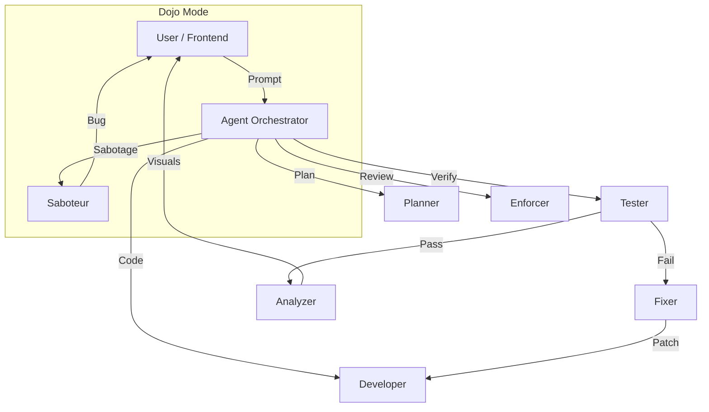

# 🌌 Autonomous Coding Partner: Cyberpunk IDE Edition

[](https://opensource.org/licenses/MIT)
[](https://groq.com/)

An advanced, self-healing Autonomous Development Environment (ADE) wrapped in a high-octane Cyberpunk aesthetic. This isn't just a code generator; it's a team of AI agents that plan, write, test, and fix your code in real-time.

---

## � SYSTEM_OVERVIEW // VISUALS

| Dashboard Execution |
| :---: | :---: |
| [Dashboard Screenshot]
 | [Console Screenshot]
 |

---

## 🔥 KEY_FEATURES

### 🧠 Multi-Agent Orchestration
- **Planner Agent**: Architecting complex blueprints from simple prompts.
- **Developer Agent**: Generating production-ready code across multiple stacks.
- **Tester Agent**: Autonomously creating unit tests for every file.
- **Fixer Agent**: Real-time debugging and self-healing when tests fail.
- **Enforcer Agent**: Strict compliance checking against style guides and specs.
- **Analyzer Agent**: Deep static analysis and architectural visualization.
- **Saboteur Agent**: Injects logic bugs for "Dojo Mode" training and challenges.

### 🏗️ SYSTEM_ARCHITECTURE


### 🌍 Multi-Stack Agnostic
- Full support for **Python**, **Node.js (JS/TS)**, and **Go**.
- **Auto-Dependency Management**: The agents detect required libraries and run `pip install` or `npm install` automatically in the background.

### ⚡ Cyberpunk UI/UX
- VS Code inspired **Integrated Terminal**.
- Glassmorphic panels with Neopink glow effects.
- Real-time updates via **WebSockets** for zero-latency feedback.

---

## 🛠️ TECH_STACK

- **Core**: Python 3.11+, FastAPI, React 18
- **AI Engine**: Llama 3.3 (70b) via Groq API
- **Real-time**: WebSockets (Python `websockets` + React Hooks)
- **Infrastructure**: Docker & Docker Compose
- **Styling**: Vanilla CSS with Cyberpunk Motion Effects

---

## 🚀 BOOT_SEQUENCE

### 1. Clone the Mission
```bash
git clone https://github.com/yashikabisht1/autonomous-coding-partner.git
cd autonomous-coding-partner
```

### 2. Configure Credentials
Create a `.env` file in the root directory:
```env
GROQ_API_KEY=your_api_key_here
GROQ_MODEL=llama-3.3-70b-versatile
```

### 3. Execution (Docker)
```bash
docker-compose up --build
```
*Wait for the neons to light up. Access the IDE at [http://localhost:3000](http://localhost:3000)*

---

## 📖 LESSONS_LEARNED

This project served as a deep-dive into:
- Efficient **Async/Await** patterns in Python.
- Multi-agent communication and state synchronization.
- AI **Self-Healing** loops and diagnostic feedback.

---

## 🚦 TROUBLESHOOTING // RATE_LIMITS

### Groq API Token Limits (Error 429)
The free tier of Groq has specific limits on **Tokens Per Day (TPD)**. If you generate several complex projects in a row, you may see a "Rate Limit Reached" error.

- **Effect**: Project generation will halt and mark the status as `FAILED`.
- **Solution**: Wait for the time specified in the error message (usually 10-15 minutes) for your quota to reset.
- **Robustness**: The system is engineered to fail gracefully—it will never save error messages into your source code files.

---

## 🤝 CONTRIBUTING // PROTOCOLS
1. Fork the Project
2. Create your Feature Branch (`git checkout -b feature/AmazingFeature`)
3. Commit your Changes (`git commit -m 'Add some AmazingFeature'`)
4. Push to the Branch (`git push origin feature/AmazingFeature`)
5. Open a Pull Request

---

*Built with ♥ by [yashikabisht1](https://github.com/yashikabisht1) • Powered by Neural Networks*
